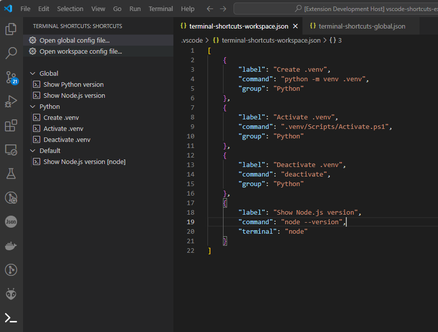

# Terminal Shortcuts 

This extentions allows you to create and save custom terminal shortcuts to use in Visual Studio Code. You can set any command that runs on a terminal as a shortcut. Shortcuts can be saved as Global (available from any VSCode window) or Workspace (avaliable only for a specific workspace).



## Features

* Create custom terminal shortcuts
* Specify a terminal window name to always run a shortcut at the same terminal
* Create VSCode-wide shortcuts or shortcuts for specific workspaces

## Usage

* Select `Open global config file...` to edit global shortcuts
* Select `Open workspace config file...` to edit workspace shortcuts
* Edit the config file to create your shortcuts. For each item, set these parameters:
    * label: text displayed in the shortcut list
    * command: the command run by this shortcut
    * group (optional): name of the shortcut group
    * terminal (optional): set this to always run the shortcut in a terminal with this name

```
[
    {
        "label": "Show Python version",
        "command": "python --version",
        "group": "Workspace"
    },
    {
        "label": "Show Node.js version",
        "command": "node --version",
        "group": "Workspace"
    }
]
```
